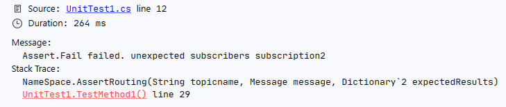

[](https://www.nuget.org/packages/MockServiceBus)

# MockServiceBus

Supporting & maintaining [Azure Service Bus routing rules](https://docs.microsoft.com/en-us/azure/service-bus-messaging/topic-filters) could be tricky to design without regressions and unexpected behaviors.

`MockServiceBus` with help of [TSQL.Parser](https://www.nuget.org/packages/TSQL.Parser/) provides solution to unit test your subscriptions routing.

> Install-Package MockServiceBus

## Basic example
A brokered message with custom property `flag=1` to be correctly `transfered` for subscription1 and `ignored` for subscription2.

`NameSpace.AssertRouting(String topicname, Message message, Dictionary`2 expectedResults)`

```csharp
        [TestMethod]
        public void TestMethod1()
        {
            var servicebus = new NameSpace();

            var subscription1 = new Subscription { Name = "subscription1", Rules = new List<Rule> { new Rule { Filter = "flag='1'" } } };
            var subscription2 = new Subscription { Name = "subscription2", Rules = new List<Rule> { new Rule { Filter = "flag='2'" } } };

            servicebus.Topics.Add(new Topic { Name = "topic", Subscriptions = new List<Subscription> { subscription1, subscription2 } });

            var message = new Message
            {
                CustomProperties = new Dictionary<string, object>
                {
                    { "flag", "1" },
                }
            };

            servicebus.AssertRouting("topic", message, new Dictionary<string, MessageState> {
                { "subscription1", MessageState.Transfered },
                { "subscription2", MessageState.Ignored }
            });

        }
```
will return green test result


* changing the flag value without changing expected outcome
```csharp
            var message = new Message
            {
                CustomProperties = new Dictionary<string, object>
                {
                    { "flag", "2" },
                }
            };
```

>     Assert.AreEqual failed. Expected:<Transfered>. Actual:<Ignored>. subscription1


* not declaring expected output for a specific subscription

```csharp
            servicebus.AssertRouting("topic", message, new Dictionary<string, MessageState> {
                { "subscription1", MessageState.Transfered }
            });
```

> Assert.Fail failed. unexpected subscribers subscription2



## Casting numbers
MockServiceBus needs a litle help for `number` types with prefixing with `{Int32} fieldname`. **space is important**

Switching from `flag='1'` to `flag=1`
```csharp
            var subscription1 = new Subscription { Name = "subscription1", Rules = new List<Rule> { new Rule { Filter = "{Int32} flag=1" } } };

            var message = new Message
            {
                CustomProperties = new Dictionary<string, object>
                {
                    { "flag", 1 },
                }
            };
```

## Supported features
Full list not available now, but complex queries are supported

> NOT EXISTS([forcedestination]) AND NOT EXISTS([subitem]) AND [fromsystem] != '{system}' AND [reference.crmguid] != 'null' AND {Int32} [contract.active] = 1  AND (NOT EXISTS([startdelta]) OR {Int32} [startdelta] >= 0) AND ([fromsystem] != 'sap'

## Next ?

* whole structure of topics and subscriptions (+ rules) can be loaded from json file
* re-using same structure files & unit test for automatically updating subscriptions rules in Azure Service Bus